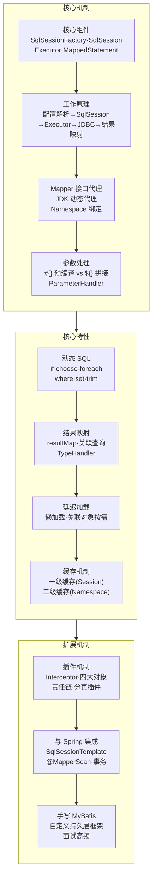

```mermaid
flowchart TB
    subgraph 核心["核心机制"]
        direction TB
        M1["核心组件<br/>SqlSessionFactory·SqlSession<br/>Executor·MappedStatement"] --> M2["工作原理<br/>配置解析→SqlSession<br/>→Executor→JDBC→结果映射"]
        M2 --> M3["Mapper 接口代理<br/>JDK 动态代理<br/>Namespace 绑定"]
        M3 --> M4["参数处理<br/>#{} 预编译 vs ${} 拼接<br/>ParameterHandler"]
    end

    subgraph 特性["核心特性"]
        direction TB
        F1["动态 SQL<br/>if·choose·foreach<br/>where·set·trim"] --> F2["结果映射<br/>resultMap·关联查询<br/>TypeHandler"]
        F2 --> F3["延迟加载<br/>懒加载·关联对象按需"]
        F3 --> F4["缓存机制<br/>一级缓存(Session)<br/>二级缓存(Namespace)"]
    end

    subgraph 扩展["扩展机制"]
        direction TB
        P1["插件机制<br/>Interceptor·四大对象<br/>责任链·分页插件"] --> P2["与 Spring 集成<br/>SqlSessionTemplate<br/>@MapperScan·事务"]
        P2 --> P3["手写 MyBatis<br/>自定义持久层框架<br/>面试高频"]
    end

    核心 --> 特性 --> 扩展
```

