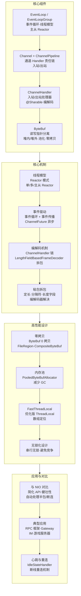

```mermaid
flowchart TB
    subgraph 核心["核心组件"]
        direction TB
        N1["EventLoop / EventLoopGroup<br/>事件循环·线程模型<br/>主从 Reactor"] --> N2["Channel + ChannelPipeline<br/>通道·Handler 责任链<br/>入站/出站"]
        N2 --> N3["ChannelHandler<br/>入站/出站处理器<br/>@Sharable·编解码"]
        N3 --> N4["ByteBuf<br/>读写指针分离<br/>堆内/堆外·池化·零拷贝"]
    end

    subgraph 机制["核心机制"]
        direction TB
        M1["线程模型<br/>Reactor 模式<br/>单/多/主从 Reactor"] --> M2["事件驱动<br/>事件循环 + 事件传播<br/>ChannelFuture 异步"]
        M2 --> M3["编解码机制<br/>ChannelHandler 链<br/>LengthFieldBasedFrameDecoder 拆包"]
        M3 --> M4["粘包拆包<br/>定长·分隔符·长度字段<br/>编解码器解决"]
    end

    subgraph 高性能["高性能设计"]
        direction TB
        P1["零拷贝<br/>ByteBuf 0 拷贝<br/>FileRegion·CompositeByteBuf"] --> P2["内存池<br/>PooledByteBufAllocator<br/>减少 GC"]
        P2 --> P3["FastThreadLocal<br/>优化版 ThreadLocal<br/>数组定位"]
        P3 --> P4["无锁化设计<br/>串行无锁·避免竞争"]
    end

    subgraph 应用["应用与对比"]
        direction TB
        A1["与 NIO 对比<br/>简化 API·健壮性<br/>自动处理半包/断连"] --> A2["典型应用<br/>RPC 框架·Gateway<br/>IM·游戏服务器"]
        A2 --> A3["心跳与重连<br/>IdleStateHandler<br/>断线重连机制"]
    end

    核心 --> 机制 --> 高性能 --> 应用
```
