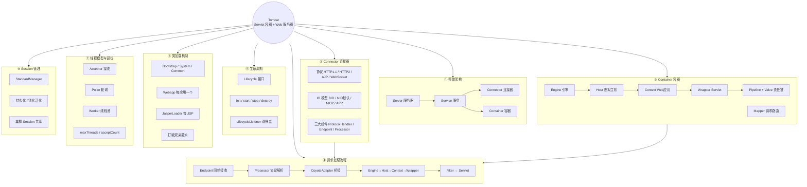

```mermaid
flowchart TD
    T(("Tomcat<br/>Servlet 容器 + Web 服务器"))

    subgraph ARCH["① 整体架构"]
        Server["Server 服务器"]
        Service["Service 服务"]
        Connector["Connector 连接器"]
        Container["Container 容器"]
        Server --> Service
        Service --> Connector
        Service --> Container
    end

    subgraph CONN["② Connector 连接器"]
        C1["协议 HTTP1.1 / HTTP2 / AJP / WebSocket"]
        C2["IO 模型 BIO / NIO默认 / NIO2 / APR"]
        C3["三大组件 ProtocolHandler / Endpoint / Processor"]
    end

    subgraph CONT["③ Container 容器"]
        E1["Engine 引擎"]
        E2["Host 虚拟主机"]
        E3["Context Web应用"]
        E4["Wrapper Servlet"]
        E5["Pipeline + Valve 责任链"]
        E6["Mapper 请求路由"]
        E1 --> E2
        E2 --> E3
        E3 --> E4
        E4 --> E5
    end

    subgraph FLOW["④ 请求处理流程"]
        F1["Endpoint 网络接收"]
        F2["Processor 协议解析"]
        F3["CoyoteAdapter 桥接"]
        F4["Engine→Host→Context→Wrapper"]
        F5["Filter → Servlet"]
        F1 --> F2
        F2 --> F3
        F3 --> F4
        F4 --> F5
    end

    subgraph MECH["⑤ 生命周期"]
        L1["Lifecycle 接口"]
        L2["init / start / stop / destroy"]
        L3["LifecycleListener 观察者"]
    end

    subgraph CLASS["⑥ 类加载机制"]
        CL1["Bootstrap / System / Common"]
        CL2["Webapp 每应用一个"]
        CL3["JasperLoader 每 JSP"]
        CL4["打破双亲委派"]
    end

    subgraph THREAD["⑦ 线程模型与调优"]
        TH1["Acceptor 接收"]
        TH2["Poller 轮询"]
        TH3["Worker 线程池"]
        TH4["maxThreads / acceptCount"]
    end

    subgraph SESSION["⑧ Session 管理"]
        SE1["StandardManager"]
        SE2["持久化 / 钝化活化"]
        SE3["集群 Session 共享"]
    end

    T --> ARCH
    T --> CONN
    T --> CONT
    T --> FLOW
    T --> MECH
    T --> CLASS
    T --> THREAD
    T --> SESSION
    CONN --> FLOW
    CONT --> FLOW
```

