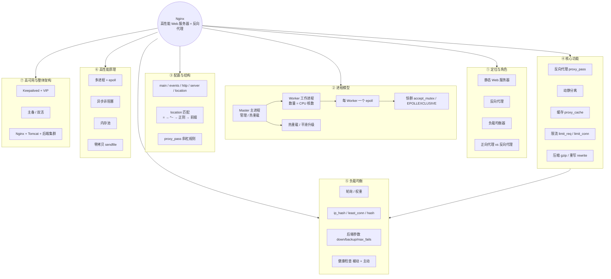

```mermaid
flowchart TD
    N(("Nginx<br/>高性能 Web 服务器 + 反向代理"))

    subgraph ROLE["① 定位与角色"]
        R1["静态 Web 服务器"]
        R2["反向代理"]
        R3["负载均衡器"]
        R4["正向代理 vs 反向代理"]
    end

    subgraph PROC["② 进程模型"]
        M["Master 主进程<br/>管理 / 热重载"]
        W["Worker 工作进程<br/>数量 = CPU 核数"]
        EP["每 Worker 一个 epoll"]
        QK["惊群 accept_mutex / EPOLLEXCLUSIVE"]
        RE["热重载 / 平滑升级"]
        M --> W
        W --> EP
        EP --> QK
        M --> RE
    end

    subgraph CONF["③ 配置与结构"]
        CF1["main / events / http / server / location"]
        CF2["location 匹配<br/>= → ^~ → 正则 → 前缀"]
        CF3["proxy_pass 斜杠规则"]
    end

    subgraph FUNC["④ 核心功能"]
        F1["反向代理 proxy_pass"]
        F2["动静分离"]
        F3["缓存 proxy_cache"]
        F4["限流 limit_req / limit_conn"]
        F5["压缩 gzip / 重写 rewrite"]
    end

    subgraph LB["⑤ 负载均衡"]
        L1["轮询 / 权重"]
        L2["ip_hash / least_conn / hash"]
        L3["后端参数 down/backup/max_fails"]
        L4["健康检查 被动 + 主动"]
    end

    subgraph FAST["⑥ 高性能原理"]
        A1["多进程 + epoll"]
        A2["异步非阻塞"]
        A3["内存池"]
        A4["零拷贝 sendfile"]
    end

    subgraph HA["⑦ 高可用与整体架构"]
        H1["Keepalived + VIP"]
        H2["主备 / 双活"]
        H3["Nginx + Tomcat + 后端集群"]
    end

    N --> ROLE
    N --> PROC
    N --> CONF
    N --> FUNC
    N --> LB
    N --> FAST
    N --> HA
    FUNC --> LB
```

