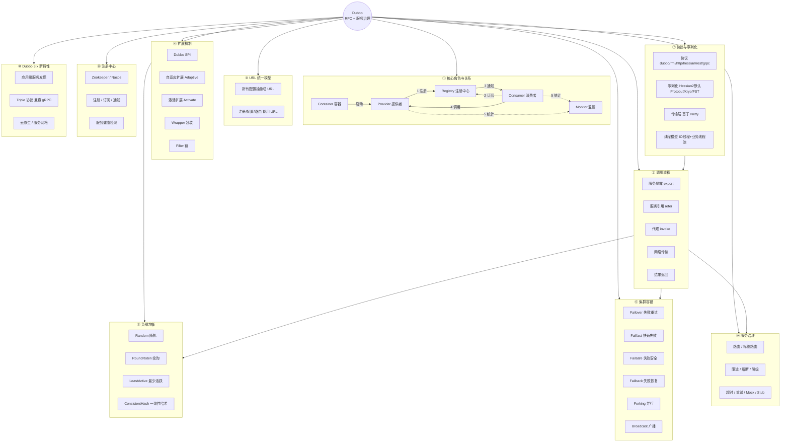

```mermaid
flowchart TD
    D(("Dubbo<br/>RPC + 服务治理"))

    subgraph ROLE["① 核心角色与关系"]
        P["Provider 提供者"]
        C["Consumer 消费者"]
        R["Registry 注册中心"]
        MO["Monitor 监控"]
        CO["Container 容器"]
    end
    CO -- 启动 --> P
    P -- "1 注册" --> R
    C -- "2 订阅" --> R
    R -- "3 通知" --> C
    C -- "4 调用" --> P
    C -. "5 统计" .-> MO
    P -. "5 统计" .-> MO

    subgraph FLOW["② 调用流程"]
        F1["服务暴露 export"]
        F2["服务引用 refer"]
        F3["代理 invoke"]
        F4["网络传输"]
        F5["结果返回"]
    end

    subgraph URLM["③ URL 统一模型"]
        U1["所有配置抽象成 URL"]
        U2["注册/配置/路由 都用 URL"]
    end

    subgraph EXT["④ 扩展机制"]
        S1["Dubbo SPI"]
        S2["自适应扩展 Adaptive"]
        S3["激活扩展 Activate"]
        S4["Wrapper 包装"]
        S5["Filter 链"]
    end

    subgraph LB["⑤ 负载均衡"]
        L1["Random 随机"]
        L2["RoundRobin 轮询"]
        L3["LeastActive 最少活跃"]
        L4["ConsistentHash 一致性哈希"]
    end

    subgraph FAULT["⑥ 集群容错"]
        T1["Failover 失败重试"]
        T2["Failfast 快速失败"]
        T3["Failsafe 失败安全"]
        T4["Failback 失败恢复"]
        T5["Forking 并行"]
        T6["Broadcast 广播"]
    end

    subgraph PROTO["⑦ 协议与序列化"]
        H1["协议 dubbo/rmi/http/hessian/rest/grpc"]
        H2["序列化 Hessian2默认 Protobuf/Kryo/FST"]
        H3["传输层 基于 Netty"]
        H4["线程模型 IO线程+业务线程池"]
    end

    subgraph REG["⑧ 注册中心"]
        RG1["Zookeeper / Nacos"]
        RG2["注册 / 订阅 / 通知"]
        RG3["服务健康检测"]
    end

    subgraph GOV["⑨ 服务治理"]
        G1["路由 / 标签路由"]
        G2["限流 / 熔断 / 降级"]
        G3["超时 / 重试 / Mock / Stub"]
    end

    subgraph NEW["⑩ Dubbo 3.x 新特性"]
        N1["应用级服务发现"]
        N2["Triple 协议 兼容 gRPC"]
        N3["云原生 / 服务网格"]
    end

    D --> ROLE
    D --> FLOW
    D --> URLM
    D --> EXT
    D --> LB
    D --> FAULT
    D --> PROTO
    D --> REG
    D --> GOV
    D --> NEW
    FLOW --> LB
    FLOW --> FAULT
    PROTO --> FLOW
    FLOW --> GOV
```

