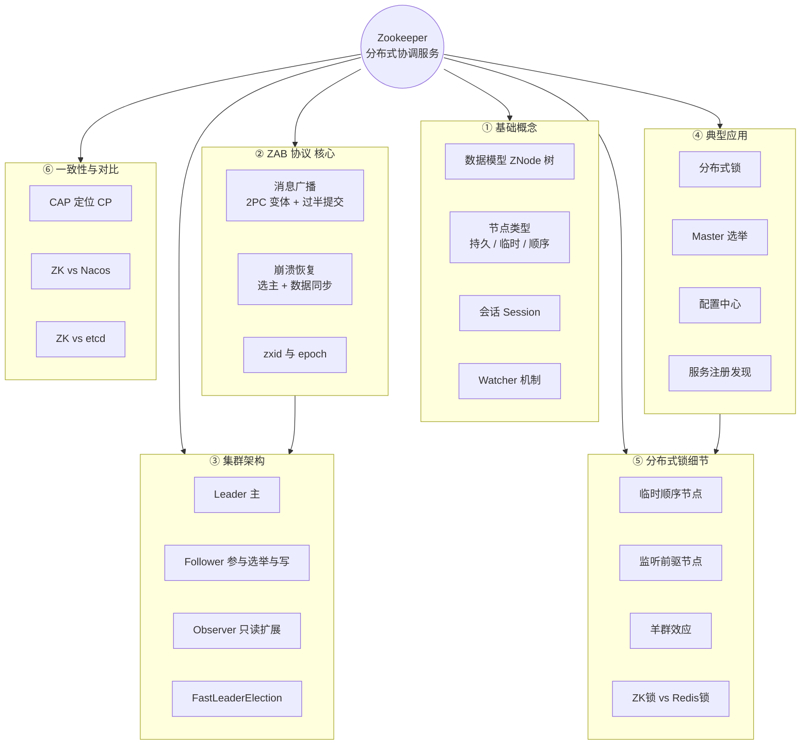

```mermaid
flowchart TD
    Z(("Zookeeper<br/>分布式协调服务"))

    subgraph BASE["① 基础概念"]
        B1["数据模型 ZNode 树"]
        B2["节点类型<br/>持久 / 临时 / 顺序"]
        B3["会话 Session"]
        B4["Watcher 机制"]
    end

    subgraph ZABP["② ZAB 协议 核心"]
        Z1["消息广播<br/>2PC 变体 + 过半提交"]
        Z2["崩溃恢复<br/>选主 + 数据同步"]
        Z3["zxid 与 epoch"]
    end

    subgraph CLUSTER["③ 集群架构"]
        C1["Leader 主"]
        C2["Follower 参与选举与写"]
        C3["Observer 只读扩展"]
        C4["FastLeaderElection"]
    end

    subgraph APP["④ 典型应用"]
        A1["分布式锁"]
        A2["Master 选举"]
        A3["配置中心"]
        A4["服务注册发现"]
    end

    subgraph LOCK["⑤ 分布式锁细节"]
        L1["临时顺序节点"]
        L2["监听前驱节点"]
        L3["羊群效应"]
        L4["ZK锁 vs Redis锁"]
    end

    subgraph CMP["⑥ 一致性与对比"]
        D1["CAP 定位 CP"]
        D2["ZK vs Nacos"]
        D3["ZK vs etcd"]
    end

    Z --> BASE
    Z --> ZABP
    Z --> CLUSTER
    Z --> APP
    Z --> LOCK
    Z --> CMP
    ZABP --> CLUSTER
    APP --> LOCK
```
