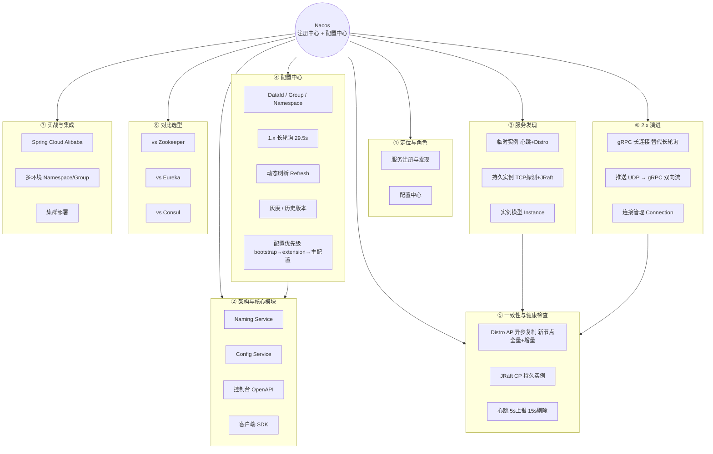

```mermaid
flowchart TD
    N(("Nacos<br/>注册中心 + 配置中心"))

    subgraph ROLE["① 定位与角色"]
        R1["服务注册与发现"]
        R2["配置中心"]
    end

    subgraph ARCH["② 架构与核心模块"]
        A1["Naming Service"]
        A2["Config Service"]
        A3["控制台 OpenAPI"]
        A4["客户端 SDK"]
    end

    subgraph FIND["③ 服务发现"]
        F1["临时实例 心跳+Distro"]
        F2["持久实例 TCP探测+JRaft"]
        F3["实例模型 Instance"]
    end

    subgraph CONF["④ 配置中心"]
        C1["DataId / Group / Namespace"]
        C2["1.x 长轮询 29.5s"]
        C3["动态刷新 Refresh"]
        C4["灰度 / 历史版本"]
        C5["配置优先级 bootstrap→extension→主配置"]
    end

    subgraph PROTO["⑤ 一致性与健康检查"]
        P1["Distro AP 异步复制 新节点全量+增量"]
        P2["JRaft CP 持久实例"]
        P3["心跳 5s上报 15s剔除"]
    end

    subgraph NEW["⑧ 2.x 演进"]
        V1["gRPC 长连接 替代长轮询"]
        V2["推送 UDP → gRPC 双向流"]
        V3["连接管理 Connection"]
    end

    subgraph CMP["⑥ 对比选型"]
        D1["vs Zookeeper"]
        D2["vs Eureka"]
        D3["vs Consul"]
    end

    subgraph USE["⑦ 实战与集成"]
        U1["Spring Cloud Alibaba"]
        U2["多环境 Namespace/Group"]
        U3["集群部署"]
    end

    N --> ROLE
    N --> ARCH
    N --> FIND
    N --> CONF
    N --> PROTO
    N --> NEW
    N --> CMP
    N --> USE
    FIND --> PROTO
    CONF --> ARCH
    NEW --> PROTO
```
