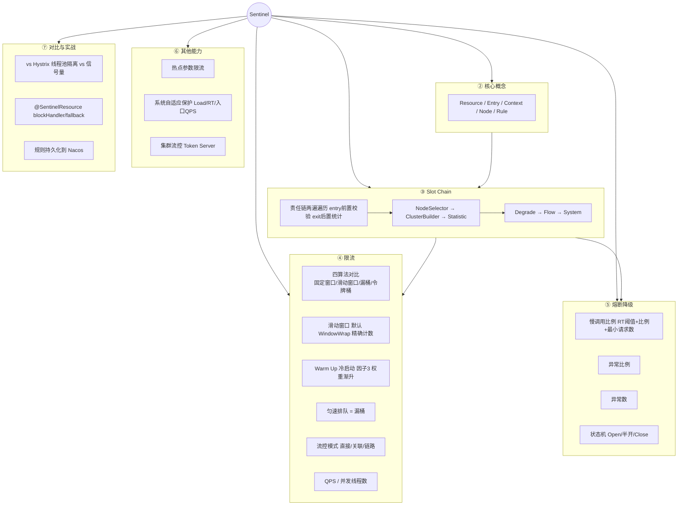

```mermaid
flowchart TD
    S(("Sentinel"))

    subgraph CORE["② 核心概念"]
        C1["Resource / Entry / Context / Node / Rule"]
    end

    subgraph CHAIN["③ Slot Chain"]
        CH1["责任链两遍遍历 entry前置校验 exit后置统计"]
        CH2["NodeSelector → ClusterBuilder → Statistic"]
        CH3["Degrade → Flow → System"]
        CH1 --> CH2 --> CH3
    end

    subgraph FLOW["④ 限流"]
        F1["四算法对比<br/>固定窗口/滑动窗口/漏桶/令牌桶"]
        F2["滑动窗口 默认 WindowWrap 精确计数"]
        F3["Warm Up 冷启动 因子3 权重渐升"]
        F4["匀速排队 = 漏桶"]
        F5["流控模式 直接/关联/链路"]
        F6["QPS / 并发线程数"]
    end

    subgraph DEG["⑤ 熔断降级"]
        D1["慢调用比例 RT阈值+比例+最小请求数"]
        D2["异常比例"]
        D3["异常数"]
        D4["状态机 Open/半开/Close"]
    end

    subgraph EXTRA["⑥ 其他能力"]
        E1["热点参数限流"]
        E2["系统自适应保护 Load/RT/入口QPS"]
        E3["集群流控 Token Server"]
    end

    subgraph USE["⑦ 对比与实战"]
        U1["vs Hystrix 线程池隔离 vs 信号量"]
        U2["@SentinelResource blockHandler/fallback"]
        U3["规则持久化到 Nacos"]
    end

    S --> CORE
    S --> CHAIN
    S --> FLOW
    S --> DEG
    S --> EXTRA
    S --> USE
    CORE --> CHAIN
    CHAIN --> FLOW
    CHAIN --> DEG
```
