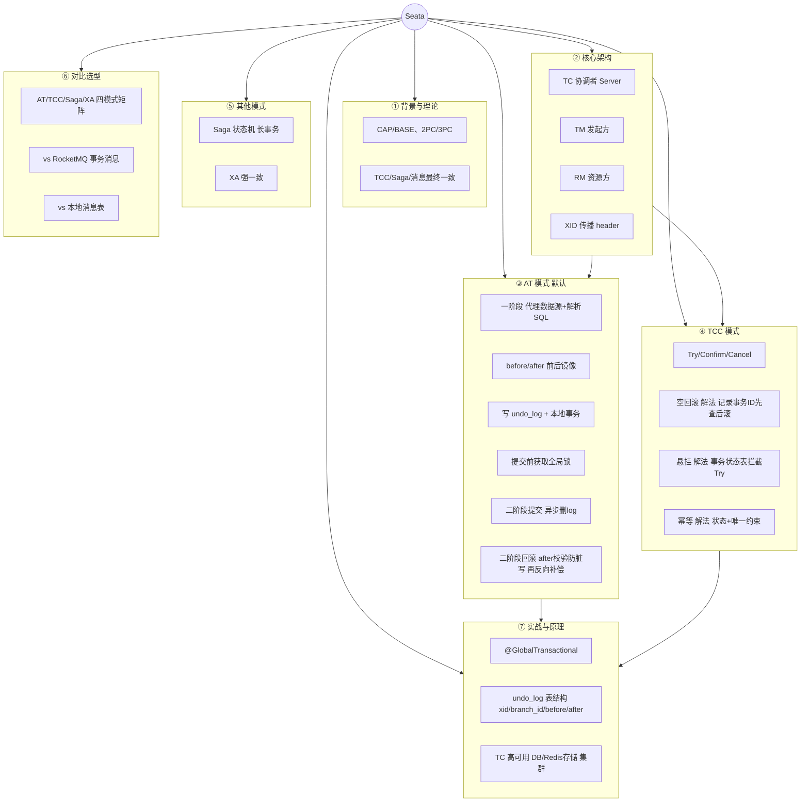

```mermaid
flowchart TD
    T(("Seata"))

    subgraph BG["① 背景与理论"]
        B1["CAP/BASE、2PC/3PC"]
        B2["TCC/Saga/消息最终一致"]
    end

    subgraph ARCH["② 核心架构"]
        A1["TC 协调者 Server"]
        A2["TM 发起方"]
        A3["RM 资源方"]
        A4["XID 传播 header"]
    end

    subgraph AT["③ AT 模式 默认"]
        AT1["一阶段 代理数据源+解析SQL"]
        AT2["before/after 前后镜像"]
        AT3["写 undo_log + 本地事务"]
        AT4["提交前获取全局锁"]
        AT5["二阶段提交 异步删log"]
        AT6["二阶段回滚 after校验防脏写 再反向补偿"]
    end

    subgraph TCC["④ TCC 模式"]
        T1["Try/Confirm/Cancel"]
        T2["空回滚 解法 记录事务ID先查后滚"]
        T3["悬挂 解法 事务状态表拦截Try"]
        T4["幂等 解法 状态+唯一约束"]
    end

    subgraph OTHER["⑤ 其他模式"]
        O1["Saga 状态机 长事务"]
        O2["XA 强一致"]
    end

    subgraph CMP["⑥ 对比选型"]
        C1["AT/TCC/Saga/XA 四模式矩阵"]
        C2["vs RocketMQ 事务消息"]
        C3["vs 本地消息表"]
    end

    subgraph USE["⑦ 实战与原理"]
        U1["@GlobalTransactional"]
        U2["undo_log 表结构 xid/branch_id/before/after"]
        U3["TC 高可用 DB/Redis存储 集群"]
    end

    T --> BG
    T --> ARCH
    T --> AT
    T --> TCC
    T --> OTHER
    T --> CMP
    T --> USE
    ARCH --> AT
    ARCH --> TCC
    AT --> USE
    TCC --> USE
```

