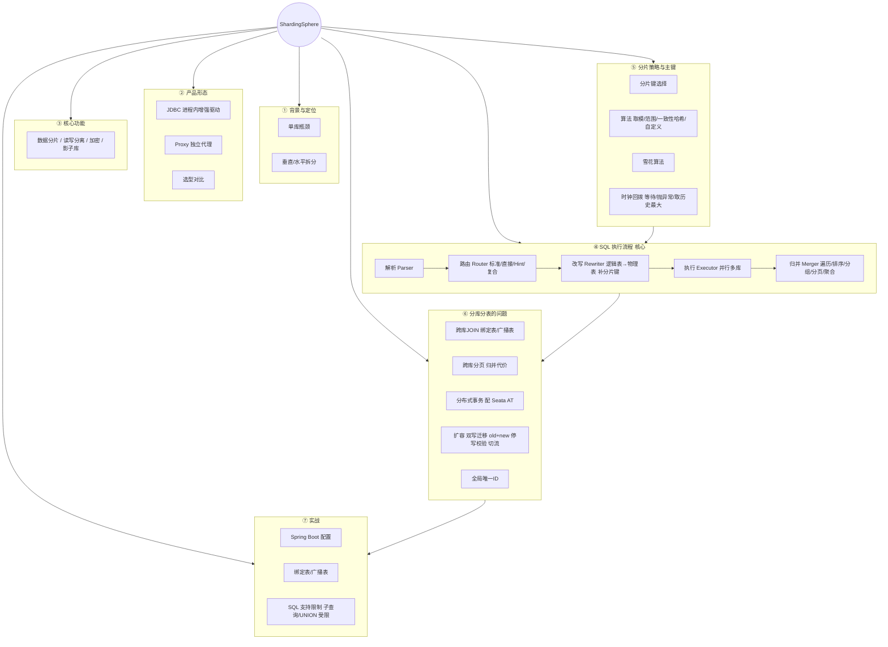

```mermaid
flowchart TD
    SS(("ShardingSphere"))

    subgraph BG["① 背景与定位"]
        B1["单库瓶颈"]
        B2["垂直/水平拆分"]
    end

    subgraph PROD["② 产品形态"]
        P1["JDBC 进程内增强驱动"]
        P2["Proxy 独立代理"]
        P3["选型对比"]
    end

    subgraph FUNC["③ 核心功能"]
        F1["数据分片 / 读写分离 / 加密 / 影子库"]
    end

    subgraph FLOW["④ SQL 执行流程 核心"]
        L1["解析 Parser"]
        L2["路由 Router 标准/直接/Hint/复合"]
        L3["改写 Rewriter 逻辑表→物理表 补分片键"]
        L4["执行 Executor 并行多库"]
        L5["归并 Merger 遍历/排序/分组/分页/聚合"]
        L1 --> L2 --> L3 --> L4 --> L5
    end

    subgraph KEY["⑤ 分片策略与主键"]
        K1["分片键选择"]
        K2["算法 取模/范围/一致性哈希/自定义"]
        K3["雪花算法"]
        K4["时钟回拨 等待/抛异常/取历史最大"]
    end

    subgraph PROBLEM["⑥ 分库分表的问题"]
        PR1["跨库JOIN 绑定表/广播表"]
        PR2["跨库分页 归并代价"]
        PR3["分布式事务 配 Seata AT"]
        PR4["扩容 双写迁移 old+new 停写校验 切流"]
        PR5["全局唯一ID"]
    end

    subgraph USE["⑦ 实战"]
        U1["Spring Boot 配置"]
        U2["绑定表/广播表"]
        U3["SQL 支持限制 子查询/UNION 受限"]
    end

    SS --> BG
    SS --> PROD
    SS --> FUNC
    SS --> FLOW
    SS --> KEY
    SS --> PROBLEM
    SS --> USE
    KEY --> FLOW
    FLOW --> PROBLEM
    PROBLEM --> USE
```
