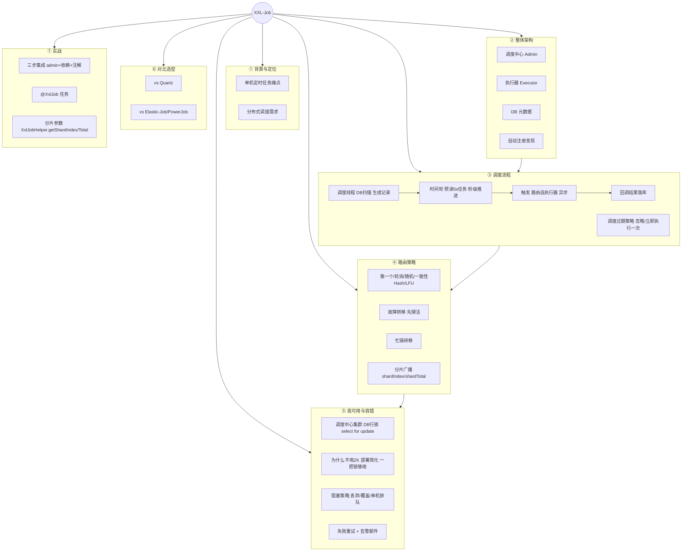

```mermaid
flowchart TD
    X(("XXL-Job"))

    subgraph BG["① 背景与定位"]
        B1["单机定时任务痛点"]
        B2["分布式调度需求"]
    end

    subgraph ARCH["② 整体架构"]
        A1["调度中心 Admin"]
        A2["执行器 Executor"]
        A3["DB 元数据"]
        A4["自动注册发现"]
    end

    subgraph FLOW["③ 调度流程"]
        L1["调度线程 DB扫描 生成记录"]
        L2["时间轮 预读5s任务 秒级推进"]
        L3["触发 路由选执行器 异步"]
        L4["回调结果落库"]
        L5["调度过期策略 忽略/立即执行一次"]
        L1 --> L2 --> L3 --> L4
    end

    subgraph ROUTE["④ 路由策略"]
        R1["第一个/轮询/随机/一致性Hash/LFU"]
        R2["故障转移 先探活"]
        R3["忙碌转移"]
        R4["分片广播 shardIndex/shardTotal"]
    end

    subgraph HA["⑤ 高可用与容错"]
        H1["调度中心集群 DB行锁 select for update"]
        H2["为什么不用ZK 部署简化 一把锁够用"]
        H3["阻塞策略 丢弃/覆盖/单机排队"]
        H4["失败重试 + 告警邮件"]
    end

    subgraph CMP["⑥ 对比选型"]
        C1["vs Quartz"]
        C2["vs Elastic-Job/PowerJob"]
    end

    subgraph USE["⑦ 实战"]
        U1["三步集成 admin+依赖+注解"]
        U2["@XxlJob 任务"]
        U3["分片参数 XxlJobHelper.getShardIndex/Total"]
    end

    X --> BG
    X --> ARCH
    X --> FLOW
    X --> ROUTE
    X --> HA
    X --> CMP
    X --> USE
    ARCH --> FLOW
    FLOW --> ROUTE
    ROUTE --> HA
```
