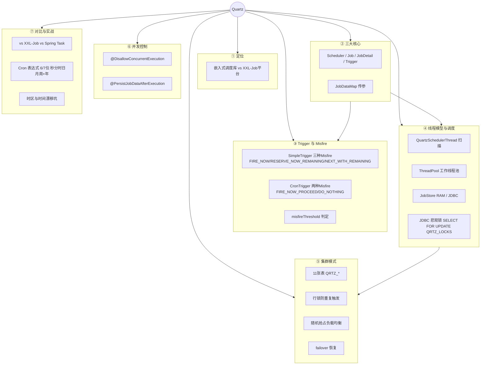

```mermaid
flowchart TD
    Q(("Quartz"))

    subgraph ROLE["① 定位"]
        R1["嵌入式调度库 vs XXL-Job平台"]
    end

    subgraph CORE["② 三大核心"]
        C1["Scheduler / Job / JobDetail / Trigger"]
        C2["JobDataMap 传参"]
    end

    subgraph TRI["③ Trigger 与 Misfire"]
        T1["SimpleTrigger 三种Misfire<br/>FIRE_NOW/RESERVE_NOW_REMAINING/NEXT_WITH_REMAINING"]
        T2["CronTrigger 两种Misfire<br/>FIRE_NOW_PROCEED/DO_NOTHING"]
        T3["misfireThreshold 判定"]
    end

    subgraph THREAD["④ 线程模型与调度"]
        H1["QuartzSchedulerThread 扫描"]
        H2["ThreadPool 工作线程池"]
        H3["JobStore RAM / JDBC"]
        H4["JDBC 悲观锁 SELECT FOR UPDATE QRTZ_LOCKS"]
    end

    subgraph CLUSTER["⑤ 集群模式"]
        L1["11张表 QRTZ_*"]
        L2["行锁防重复触发"]
        L3["随机抢占负载均衡"]
        L4["failover 恢复"]
    end

    subgraph CTRL["⑥ 并发控制"]
        X1["@DisallowConcurrentExecution"]
        X2["@PersistJobDataAfterExecution"]
    end

    subgraph CMP["⑦ 对比与实战"]
        U1["vs XXL-Job vs Spring Task"]
        U2["Cron 表达式 6/7位 秒分时日月周+年"]
        U3["时区与时间漂移坑"]
    end

    Q --> ROLE
    Q --> CORE
    Q --> TRI
    Q --> THREAD
    Q --> CLUSTER
    Q --> CTRL
    Q --> CMP
    CORE --> TRI
    CORE --> THREAD
    THREAD --> CLUSTER
```

